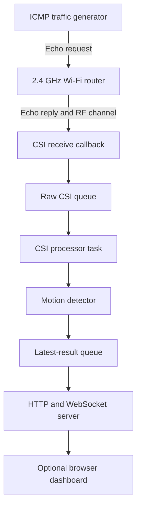

# ESP32-S3 Wi-Fi CSI Motion Sensing

On-device, device-free motion detection using Wi-Fi Channel State Information (CSI), an ESP32-S3, and a conventional 2.4 GHz Wi-Fi router.

> **Status:** Functional research prototype. The complete acquisition, processing, decision, provisioning, and dashboard pipeline runs on the ESP32-S3. Formal accuracy benchmarking is planned work.

## Table of Contents

- [Overview](#overview)
- [Key Features](#key-features)
- [System Architecture](#system-architecture)
- [Operating Modes](#operating-modes)
- [CSI Processing Pipeline](#csi-processing-pipeline)
- [Motion Detection Method](#motion-detection-method)
- [Hardware Requirements](#hardware-requirements)
- [Software Requirements](#software-requirements)
- [Project Structure](#project-structure)
- [Build and Flash](#build-and-flash)
- [First-Time Wi-Fi Provisioning](#first-time-wi-fi-provisioning)
- [Normal Operation](#normal-operation)
- [Changing the Wi-Fi Network](#changing-the-wi-fi-network)
- [Dashboard and Network API](#dashboard-and-network-api)
- [Calibration and Test Procedure](#calibration-and-test-procedure)
- [Current Results](#current-results)
- [Limitations](#limitations)
- [Roadmap](#roadmap)
- [References](#references)

## Overview

Human motion modifies indoor Wi-Fi propagation paths through reflection, scattering, shadowing, and diffraction. These changes appear in the channel frequency response estimated for individual OFDM subcarriers. This project captures the CSI of packets received from the connected router and converts temporal CSI variations into a motion score.

The current implementation:

- Requires one ESP32-S3 and one existing Wi-Fi router.
- Generates its own measurement traffic by periodically pinging the default gateway.
- Performs CSI acquisition and motion processing locally on the ESP32-S3.
- Does not require a laptop to generate sensing traffic or calculate motion.
- Uses a browser only as an optional real-time dashboard.
- Detects motion rather than identifying a person or recognizing a specific activity.

## Key Features

- Wi-Fi Station mode with credentials stored in NVS.
- SoftAP-based first-time provisioning.
- Safe pending/active credential workflow.
- Automatic return to provisioning if connection attempts fail.
- Router-driven CSI acquisition using ICMP Echo traffic.
- LLTF CSI extraction with 52 selected subcarriers.
- BSSID, channel, length, timestamp, and validity checks.
- Non-blocking CSI callback connected to a FreeRTOS queue.
- On-device filtering, baseline calibration, robust threshold estimation, and motion classification.
- Four detector states: `WARMUP`, `CALIBRATING`, `STATIC`, and `MOVING`.
- HTTP dashboard with real-time WebSocket streaming.
- Runtime recalibration from the dashboard.
- Received, dropped, and invalid packet statistics.

## System Architecture



The CSI callback runs in the Wi-Fi task context. It validates and copies only the required information to a queue. All filtering and mathematical processing are performed by a lower-priority FreeRTOS task, keeping the Wi-Fi callback short and non-blocking.

## Operating Modes

### Provisioning mode

Provisioning mode is entered when:

- No valid active Wi-Fi configuration exists.
- A newly submitted pending configuration cannot connect.
- The stored active network cannot be reached within the configured timeout.
- The `BOOT` button (`GPIO0`) is held for three seconds during normal operation.

The ESP32-S3 creates a SoftAP and hosts a configuration page at:

```text
http://192.168.4.1
```

Submitted credentials are first stored as a pending configuration. They become active only after the ESP32-S3 successfully connects, reducing the risk of losing a previously working configuration.

### Normal sensing mode

After obtaining an IP address, the following services are started in order:

1. CSI capture.
2. CSI processing task.
3. Dashboard server.
4. Periodic traffic generator.

The default sensing rate is 20 Hz. Runtime input is constrained to the range 20–100 Hz.

## CSI Processing Pipeline

### 1. Packet acquisition

The ESP32-S3 periodically sends an ICMP Echo request to the default gateway. The router reply creates a repeatable stream of received Wi-Fi packets from which CSI is estimated.

The capture callback accepts a packet only when:

- Its source MAC matches the connected router BSSID.
- Its primary channel matches the connected router channel.
- At least 128 LLTF CSI bytes are available.
- `first_word_invalid` is false.
- Its hardware receive timestamp is newer than the previous accepted timestamp.

Invalid packets are counted separately. If the raw queue is full, the sample is counted as dropped.

### 2. Complex CSI decoding

Each LLTF subcarrier is represented by two signed 8-bit values in the following order:

```text
imaginary, real
```

For subcarrier `k`, let `R` denote the real component and `I` denote the imaginary component. The complex sample is:

$$
H_k = R_k + jI_k
$$

where the ESP-IDF buffer provides the imaginary component first and the real component second.

The implementation maps the 64 LLTF FFT positions to subcarrier indices and selects:

$$
k \in \{-26,\ldots,-1,+1,\ldots,+26\}
$$

DC and guard subcarriers are excluded, leaving 52 CSI values.

### 3. Power and amplitude

Power is calculated for diagnostics:

$$
P_{t,k}=I_{t,k}^{2}+Q_{t,k}^{2}
$$

Amplitude is used by the motion detector:

$$
A_{t,k}=\sqrt{P_{t,k}}
$$

The displayed `CSI mean power` is therefore a diagnostic measurement. It is not used directly as the final motion decision.

### 4. Per-packet normalization

The average amplitude of packet `t` is:

$$
\overline{A}_t=\frac{1}{K}\sum_{k=1}^{K}A_{t,k}
$$

Each amplitude is normalized as:

$$
X_{t,k}=\frac{A_{t,k}}{\overline{A}_t}
$$

This reduces common packet-level gain variation while preserving the relative CSI shape across subcarriers.

### 5. Temporal smoothing

An exponential moving average is applied independently to every selected subcarrier:

$$
\widetilde{X}_{t,k}=\alpha X_{t,k}+(1-\alpha)\widetilde{X}_{t-1,k}
$$

with:

$$
\alpha=0.25
$$

## Motion Detection Method

### Calibration sequence

At 20 Hz, a complete detector initialization takes approximately 35 seconds:

| Phase | Duration | Purpose |
|---|---:|---|
| Warm-up | 5 s | Stabilize the incoming signal and filters |
| Baseline calibration | 15 s | Estimate the static mean and noise of each subcarrier |
| Threshold calibration | 15 s | Estimate robust decision thresholds from static motion scores |

The monitored area should remain still throughout calibration.

### Standardized residual

For each subcarrier, the static baseline mean `mu_k` and noise scale `sigma_k` are estimated during calibration. The normalized residual is:

$$
z_{t,k}=\operatorname{clip}\left(
\frac{\widetilde{X}_{t,k}-\mu_k}{\sigma_k},-10,+10
\right)
$$

Clipping prevents isolated extreme values from dominating the detector.

### Fast change

Fast change measures the difference between two consecutive residual vectors:

$$
F_t=\sqrt{\frac{1}{K}\sum_{k=1}^{K}
(z_{t,k}-z_{t-1,k})^2}
$$

This feature responds primarily to rapid CSI transitions.

### Window activity

Window activity measures the residual variance over a 1.5-second sliding window:

$$
W_t=\sqrt{\frac{1}{K}\sum_{k=1}^{K}
\operatorname{Var}_{\tau\in\mathcal{W}_t}(z_{\tau,k})}
$$

This feature maintains evidence when motion continues over multiple packets.

### Baseline distance

Baseline distance is reported as a diagnostic feature:

$$
B_t=\sqrt{\frac{1}{K}\sum_{k=1}^{K}z_{t,k}^{2}}
$$

It describes how far the current CSI vector is from the calibrated static baseline. It is displayed independently and is not directly included in the current motion score.

### Motion score

The raw score combines fast change and window activity:

$$
S_t^{raw}=0.35F_t+0.65W_t
$$

The score is then smoothed:

$$
S_t=0.30S_t^{raw}+0.70S_{t-1}
$$

### Robust thresholds

Let `m` be the median calibration score and let:

$$
\sigma_r=1.4826\times\operatorname{median}(|S_t-m|)
$$

The detector calculates two thresholds:

$$
T_{low}=m+3\sigma_r
$$

$$
T_{high}=m+5\sigma_r
$$

A minimum robust noise scale and a minimum gap between the thresholds are enforced.

### Hysteresis and state timing

- `STATIC` becomes `MOVING` only when the score remains above `T_high` for at least 200 ms.
- `MOVING` becomes `STATIC` only when the score remains below `T_low` for at least 3 seconds.
- The static baseline is updated slowly only after the detector has remained confidently static for at least 5 seconds.
- The baseline adaptation coefficient is `0.001`.

These rules reduce rapid state oscillation around a single threshold.

## Hardware Requirements

Tested configuration:

| Component | Configuration |
|---|---|
| MCU | ESP32-S3 |
| Development board | YD-ESP32-S3-N16R8 or compatible ESP32-S3 board |
| Flash | 16 MB |
| PSRAM | 8 MB Octal-SPI |
| Wi-Fi | 2.4 GHz 802.11 b/g/n |
| Access point | Conventional Wi-Fi router with IPv4 gateway |
| Host connection | USB data cable for flashing and serial monitoring |

The antenna orientation and the geometric relationship between the router, monitored area, and ESP32-S3 affect sensing sensitivity.

## Software Requirements

- Windows, Linux, or macOS.
- Visual Studio Code with PlatformIO, or PlatformIO Core.
- PlatformIO platform `espressif32 @ 7.0.1`.
- ESP-IDF framework.
- A serial driver appropriate for the development board USB interface.

The project enables:

```text
CONFIG_ESP_WIFI_CSI_ENABLED=y
CONFIG_HTTPD_WS_SUPPORT=y
```

## Project Structure

```text
ESP32_Wifi/
├── platformio.ini
├── sdkconfig.defaults
├── partitions.csv
├── CMakeLists.txt
└── src/
    ├── CMakeLists.txt
    ├── main.c                 # Application state and startup flow
    ├── app_config.h           # Persistent application configuration
    ├── config_store.c/.h      # Active and pending NVS configuration
    ├── wifi_manager.c/.h      # Wi-Fi STA lifecycle and events
    ├── provisioning.c/.h      # SoftAP provisioning service
    ├── provisioning_web.h     # Embedded provisioning page
    ├── csi_types.h            # Raw and processed CSI data models
    ├── csi_capture.c/.h       # CSI callback, validation, and raw queue
    ├── csi_traffic.c/.h       # Periodic ICMP traffic to the gateway
    ├── csi_processor.c/.h     # I/Q decoding and processing task
    ├── motion_detector.c/.h   # Calibration and motion classification
    ├── normal_services.c/.h   # Normal-mode service orchestration
    ├── web_server.c/.h        # HTTP API and WebSocket streaming
    └── dashboard_page.h       # Embedded real-time dashboard
```

Generated directories such as `.pio/` must not be committed.

## Build and Flash

### 1. Open the project

```powershell
cd D:\Innovision\ESP32\esp32_wifi\ESP32_Wifi
```

### 2. Clean and build

```powershell
pio run -t clean
pio run
```

### 3. Identify the serial port

```powershell
pio device list
```

### 4. Upload firmware

Replace `<PORT>` with the detected port. For example, on Windows it may be `COM9`.

```powershell
pio run -t upload --upload-port <PORT>
```

If automatic bootloader entry fails, hold `BOOT`, briefly press `RST`, release `RST`, start uploading, and then release `BOOT` after connection begins.

### 5. Open the serial monitor

```powershell
pio device monitor --port <PORT> --baud 115200
```

Close the serial monitor with `Ctrl+C` before uploading again.

## First-Time Wi-Fi Provisioning

1. Power the ESP32-S3 and open the serial monitor.
2. Read the provisioning SoftAP name printed in the log.
3. Connect a phone or computer to that SoftAP.
4. Open a browser and navigate to:

   ```text
   http://192.168.4.1
   ```

5. Enter the SSID and password of a 2.4 GHz Wi-Fi network.
6. Submit the configuration.
7. The ESP32-S3 tests the pending credentials.
8. If successful, the configuration is promoted and retained in NVS across power cycles.

## Normal Operation

After a successful Wi-Fi connection, the serial log reports the assigned IPv4 address:

```text
WIFI_MANAGER: Got IP address: 192.168.x.x
```

Open the dashboard from another device connected to the same local network:

```text
http://<ESP32_IP>/
```

The browser is not involved in CSI generation or motion processing. Closing the browser does not stop sensing.

## Changing the Wi-Fi Network

1. Keep the ESP32-S3 powered.
2. Hold the `BOOT` button connected to `GPIO0` for at least three seconds.
3. The normal sensing services stop and the device enters provisioning mode.
4. Connect to the SoftAP printed in the serial log.
5. Open `http://192.168.4.1` and submit the new credentials.

## Dashboard and Network API

### Dashboard measurements

| Field | Meaning |
|---|---|
| Room state | Current detector state |
| Motion score | Filtered score used by the state machine |
| High threshold | Threshold for entering `MOVING` |
| Calibration | Calibration completion percentage |
| Fast change | Consecutive-sample CSI change |
| Window activity | CSI variance over the temporal window |
| Baseline distance | Difference from the static reference |
| CSI mean power | Mean raw `I^2 + Q^2` value |
| RSSI | Received signal strength from packet metadata |
| Valid subcarriers | Number of CSI subcarriers processed |
| Received packets | Packets accepted by the capture callback |
| Dropped queue samples | Samples lost because the raw queue was full |
| Invalid CSI packets | Samples rejected by validation checks |

### Endpoints

| Method | Endpoint | Purpose |
|---|---|---|
| `GET` | `/` | Dashboard HTML |
| `GET` | `/api/status` | SSID, RSSI, channel, IP address, and uptime |
| `POST` | `/api/calibrate` | Restart motion detector calibration |
| `GET` WebSocket | `/ws` | Stream processed CSI features and detector state |

The current HTTP and WebSocket services are unencrypted and intended for a trusted local network.

## Calibration and Test Procedure

### Calibration

1. Place the router and ESP32-S3 in fixed positions.
2. Keep the monitored region empty and still.
3. Power the ESP32-S3 or press `Recalibrate` on the dashboard.
4. Do not move objects or people in the monitored region for approximately 35 seconds.
5. Wait until the dashboard shows `Calibration: 100%` and state `STATIC`.

### Functional motion test

1. Observe the static motion score for 10 seconds.
2. Walk across the router-to-ESP32 propagation region.
3. Confirm that the score crosses the high threshold and the state becomes `MOVING`.
4. Stop moving and confirm that the state returns to `STATIC` after the exit hold time.
5. Repeat at different distances and orientations.

### Recommended repeatable test matrix

| Condition | Suggested duration |
|---|---:|
| Empty and static room | 60 s |
| Hand motion at 0.5 m | 30 s |
| Hand motion at 1 m | 30 s |
| Walking perpendicular to the link | 30 s |
| Walking parallel to the link | 30 s |
| Continuous motion | 30 s |
| Static room after motion | 60 s |

Keep the router channel, device positions, and packet rate unchanged when comparing firmware versions.

## Current Results

The current prototype has demonstrated the following functional results on an ESP32-S3-N16R8:

- Persistent Wi-Fi configuration and first-time SoftAP provisioning operate correctly.
- The ESP32-S3 connects to the router and obtains an IPv4 address.
- The ESP32-S3 generates periodic gateway traffic without an external traffic-generating laptop.
- CSI callbacks provide LLTF data from the connected router.
- Fifty-two subcarriers are decoded and processed on-device.
- Real-time CSI features and state are delivered to the dashboard through WebSocket.
- Automatic calibration produces separate high and low thresholds.
- Human motion produces visible changes in window activity and motion score.
- Detector transitions use two-threshold hysteresis and an exit delay to reduce rapid `MOVING`/`STATIC` oscillation.
- Zero queue drops have been observed in the presented 20 Hz test sessions.

These results validate the end-to-end implementation, not a universal detection accuracy. Sensitivity has been observed to depend on distance, movement direction, antenna orientation, router placement, and room multipath conditions.

## Limitations

- The current method uses CSI amplitude-derived features; calibrated CSI phase is not used.
- A single router-to-ESP32 link has geometry-dependent blind or weak regions.
- The current classifier detects motion, not stationary human presence.
- Environmental changes may require recalibration.
- The current thresholds are calibrated for the deployment environment and should not be treated as universal constants.
- Accuracy, false-alarm rate, miss rate, and detection latency have not yet been established using a labeled benchmark.
- HTTP provisioning and dashboard traffic are not protected by TLS.
- This prototype is not a certified safety, security, or intrusion-alarm device.

## Roadmap

- Add feature recording and CSV export for labeled experiments.
- Apply log-amplitude normalization and common-mode removal.
- Reject or down-weight unstable subcarriers using calibration statistics.
- Add multi-lag fast-change features for different motion speeds.
- Quantify detection rate, false alarms, missed detections, and latency.
- Evaluate distance and angular sensitivity with a controlled test protocol.
- Investigate an external antenna or multiple Wi-Fi links for wider spatial coverage.
- Evaluate PCA or lightweight edge inference only after establishing a reproducible signal-processing baseline.

## References

1. Espressif Systems, [ESP32-S3 Wi-Fi Channel State Information](https://docs.espressif.com/projects/esp-idf/en/latest/esp32s3/api-guides/wifi-driver/wifi-vendor-features.html#wi-fi-channel-state-information).
2. Espressif Systems, [ESP-CSI: Applications Based on Wi-Fi CSI](https://github.com/espressif/esp-csi).
3. Espressif Systems, [ESP32-S3 Series Datasheet](https://www.espressif.com/sites/default/files/documentation/esp32-s3_datasheet_en.pdf).
4. NTU MARS, [Awesome Wi-Fi CSI Sensing](https://github.com/NTUMARS/Awesome-WiFi-CSI-Sensing).

## Responsible Use

Wi-Fi sensing can reveal human activity without cameras or wearable devices. Deploy the system only where its operation is lawful, authorized, and clearly disclosed to affected users.
